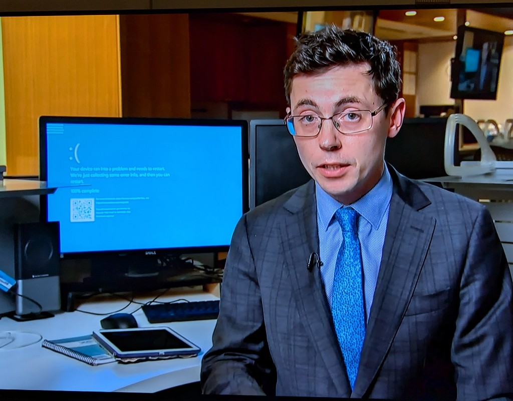

# Crowd-Strike-Recovery-Image

## Windows Recovery Bootable USB with Automated File Deletion



This repository contains scripts to automate the creation of a Windows bootable USB and includes a batch script to delete a problematic file that causes a Blue Screen of Death (BSOD). This solution is useful for recovering Windows systems affected by specific issues, such as the one caused by the CrowdStrike update.

## Table of Contents

- [Requirements](#requirements)
- [Usage](#usage)
- [Manual Steps](#manual-steps)
- [Contributing](#contributing)
- [License](#license)

## Requirements

- Windows PC
- USB drive (at least 8 GB)
- Internet connection

## Usage

1. **Download Windows Media Creation Tool:**

   Use the provided PowerShell script to download the Windows Media Creation Tool.

   ```powershell
   $url = "https://software-download.microsoft.com/download/pr/MediaCreationTool21H2.exe"
   $output = "C:\Temp\MediaCreationTool.exe"
   Invoke-WebRequest -Uri $url -OutFile $output
   ```

2. **Create Bootable USB:**

    Run the Media Creation Tool to create a bootable USB drive. This step requires manual interaction.

3. **Add Batch Script to USB:**

    Copy the batch script (delete_cs_file.bat) to the root of the bootable USB drive. This script deletes the problematic file.

    ```powershell
    Copy-Item -Path "C:\Path\to\delete_cs_file.bat" -Destination "X:\"  # Replace X: with your USB drive letter
    ```

4. **Add PowerShell Script to USB:**

    Copy the PowerShell script (run_delete_script.ps1) to the root of the bootable USB drive. This script runs the batch script in the recovery environment.

    ```powershell
    $usbDrive = "X:"  # Replace X: with your USB drive letter
    $scriptPath = "$usbDrive\delete_cs_file.bat"

    $psScript = @"
    Start-Process -FilePath "cmd.exe" -ArgumentList "/c $scriptPath" -NoNewWindow -Wait
    "@

    $psScriptPath = "$usbDrive\run_delete_script.ps1"
    Set-Content -Path $psScriptPath -Value $psScript
    ```

## Manual Steps

Run the Media Creation Tool:

Follow the prompts in the Media Creation Tool to create a bootable USB drive.

Boot from USB:

Insert the USB drive into the affected computer, change the boot order in BIOS/UEFI, and boot from the USB drive.

Access Command Prompt:

In the Windows Setup screen, select "Repair your computer" -> "Troubleshoot" -> "Advanced options" -> "Command Prompt."

Run PowerShell Script:

In the Command Prompt, run the PowerShell script to execute the batch script.

```powershell
X:\run_delete_script.ps1  # Replace X: with your USB drive letter
```

## Contributing
Contributions are welcome! Please open an issue or submit a pull request with any improvements or fixes.

## License
This project is licensed under the MIT License
